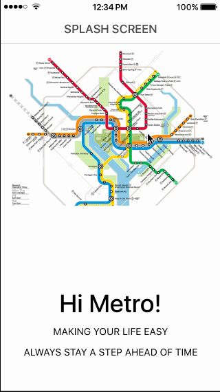
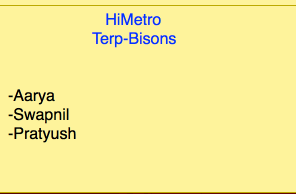

# Group Project - *Hi-Metro*

# Group Members:
  Aarya BC
  Pratyush Thapa
  Swapnil Tamrakar

Time spent: **X** hours spent in total

## Description

Very often than not, I and my friends find ourselves waiting for the metro or metro buses, but I usually find myself waiting for a long while at the metro station to catch the train in off-peak hours. Furthermore, the UI of the available metro apps do little to help our information crunch. So, we would like to help others like ourselves with a predictive map to estimate the time and if possible, prevent rush or panic among metro users. We will get the location from the user's phone and access all metro information near the user

Do not miss the metro from now on. Predictive live map to show where the metro train and metro buses are. Find all the metro information, with a great UI.

The user base is anyone who uses the metro and metro buses, but for now DC metro users.

## User Stories

**Important**
- [ ] Display the nearest stations
- [ ] Display the time of the metro and buses
- [ ] Use WMATA API
- [ ] Use Search bar to Search Stations
- [ ] Detail View Page of the trains at the stations
- [ ] Display preduct map of the selected train

The following **optional** features are implemented:

- [ ] Use OAuth, either Facebook or Twitter
- [ ] Display user's profile page

The following **additional** features are implemented:

- [ ] List anything else that you can get done to improve the app functionality!

Please list two areas of the assignment you'd like to **discuss further with your peers** during the next class (examples include better ways to implement something, how to extend your app in certain ways, etc):

1. 
2. 

## Considerations
**What is your product pitch?**
-Very often than not, I and my friends find ourselves waiting for the metro or metro buses, but I usually find myself waiting for a long while at the metro station to catch the train in off-peak hours. Furthermore, the UI of the available metro apps do little to help our information crunch. So, we would like to help others like ourselves with a predictive map to estimate the time and if possible, prevent rush or panic among metro users. We will get the location from the user's phone and access all metro information near the user. Do not miss the metro from now on. Predictive live map to show where the metro train and metro buses are. Find all the metro information, with a great User Interface.

**Who are the key stakeholders for this app?**
-The users will be the DC metro users. They will use it to get the metro information.

**What are the core flows?**
- The flow of the app relies on a central home page map of the DC area metro/bus system. This map shows the trains and buses currently as an overlay to a map element. There's also a very detailed search system that allows for filtering the search to find the desired outcome. The navigation bar shows the current page position to navigate back to the home page.

**What will your final demo look like?**
- We will be aiming to replicate the final outcome of the demo to the wireframe that we designed. We hope to spice it up with helpful animations and an interactive map element that could not be represented using the wireframe.

**What mobile features do you leverage?**
- Location: The location will be used to find out the most relevent information for the user.

**What are your technical concerns?**
- *Refreshing:* How often should the app refresh the positions of the metro/bus? Too fast and we're using too much data and   memory. Too slow and it would be inaccurate.

  *Maps:* Since the team hasn't worked with maps yet, the learning curve will be steep and figuring how overlays work, how     to work with Maps API works will be technically challenging.

## Initial Plan (WireFrame)

Here's a walkthrough of how we plan to implement our application:

GIF created with [LiceCap](http://www.cockos.com/licecap/).

## Video Walkthrough 

Here's a walkthrough of implemented user stories:

GIF created with [LiceCap](http://www.cockos.com/licecap/).

## Notes

Describe any challenges encountered while building the app.

## License

Copyright [2017] [Hi-Metro]

Licensed under the Apache License, Version 2.0 (the "License");
you may not use this file except in compliance with the License.
You may obtain a copy of the License at

http://www.apache.org/licenses/LICENSE-2.0

Unless required by applicable law or agreed to in writing, software
distributed under the License is distributed on an "AS IS" BASIS,
WITHOUT WARRANTIES OR CONDITIONS OF ANY KIND, either express or implied.
See the License for the specific language governing permissions and
limitations under the License.

